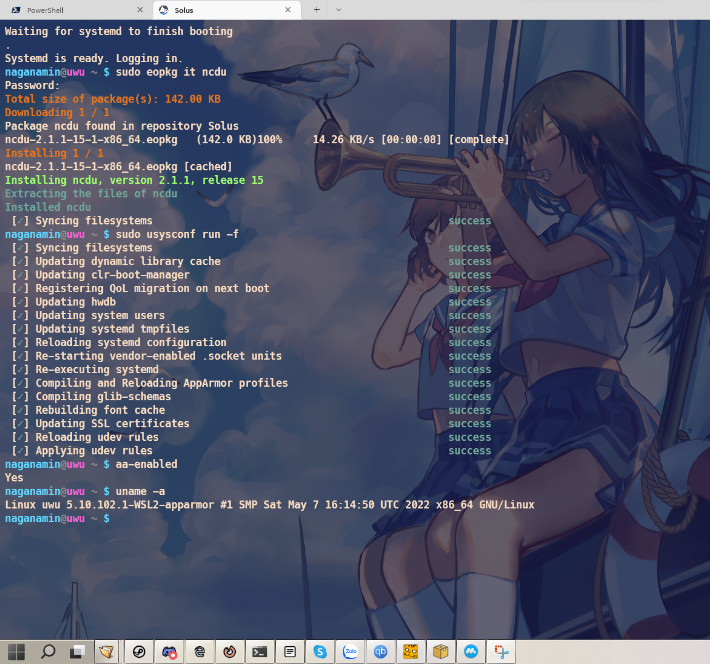

# Description

Currently, when using [SolusWSL](https://github.com/sileshn/SolusWSL) you will have many errors logged to the screen while installing packages.

Reason: [link](https://github.com/sileshn/SolusWSL#features-and-important-information)

The components that output the errors have no use in WSL environment afaik, so we can ignore those errors.

But for me, it is annoying to see red texts on the screen every day, so I tried and found a workaround.

To fix this, we need:

1. Enable systemd
2. Patch clr-boot-manager
3. Use a kernel with apparmor enabled and enable apparmor

**Step 1 and 2 are not needed if using the latest version of SolusWSL**

## Enable systemd

This is the major blocking point preventing me from finding a solution for this issue.

You may try to use [genie](https://github.com/arkane-systems/genie) to enable systemd.

But I never got it running successfully on distro other than Debian. So I have stopped working on the fix for a long time.

Recently, I discovered [this script](https://github.com/diddledani/one-script-wsl2-systemd) which works well on Solus.

If genie doesn't work for you, give the script above a try. However, it uses `[boot]` section in wsl.conf so you need to use Windows 11.

I use the minimal setup. since I have no other use for systemd.

## Patch clr-boot-manager

Information: [link](https://github.com/Fubuchi/clr-boot-manager/blob/master/README.md)

The repo above contain a pre-built binary for using in Solus.

You may need to install `efivar` to use the patched version

If you want to compile yourself, install these packages:

```
sudo eopkg it meson check-devel efivar-devel gnu-efi-devel
```

Build commands:

```
meson setup build
cd ./build
meson compile
```

The compiled binary is in ./build/src

## Compile WSL2 kernel with apparmor enable

Grab the kernel source from [microsoft/WSL2-Linux-Kernel](https://github.com/microsoft/WSL2-Linux-Kernel)

Then update this [file](https://github.com/microsoft/WSL2-Linux-Kernel/blob/linux-msft-wsl-5.10.y/Microsoft/config-wsl) with

```
CONFIG_SECURITY_APPARMOR=y
CONFIG_AUDIT=y
```

You may also need to comment the line `CONFIG_DEFAULT_SECURITY_DAC=y`

You may want to put an empty .scmversion file in the root directory to prevent the plus (+) sign to be added to the kernel name.

Reference: [link](https://stackoverflow.com/questions/19333918/dont-add-to-linux-kernel-version)

Then follow the instructions to build the kernel. After compiling successfully, copy the vmlinux file to Windows' drive

I also made a pre-built kernel [here](https://github.com/Fubuchi/WSL2-Linux-Kernel)

The repository above contains necessary flags in .config file. So you can use it to compile any WSL kernel version you want with

```
make olddefconfig
make
```

Reference: [link](https://stackoverflow.com/a/31936064/4015729)

Install apparmor

```
sudo eopkg it apparmor
```

Shutdown all WSL instances to run the new kernel

```
wsl --shutdown
```

Update [.wslconfig](https://docs.microsoft.com/en-us/windows/wsl/wsl-config#wslconfig) with this:

```
[wsl2]
kernel=path to the vmlinux
kernelCommandLine=apparmor=1 security=apparmor
```

Finally, open SolusWSL and verify the fix works:



## WSLg

While using the minimal systemd setup with WSLg, I noticed that after systemd started, the symlink `/tmp/.X11-unix -> /mnt/wslg/.X11-unix` which required for WSLg to work was removed and an actual `/tmp/.X11-unix` folder was created.

To fix this, we need to follow this [link](https://github.com/microsoft/wslg/wiki/Diagnosing-%22cannot-open-display%22-type-issues-with-WSLg)

But we need to do this again everytime WSL shutdowns and restarts. To avaoid this we can create a service

The symlink existed by default if you enable WSLg, but was removed after we start systemd, so we need to wait until it was removed and recreat it

`/usr/bin/wslg-init.sh`
```
#!/bin/bash
timeout 10 bash <<"EOF"
while [[ -L /tmp/.X11-unix ]]
do
    sleep 1
done
EOF

if [[ -d /tmp/.X11-unix ]]  && [[ ! -L /tmp/.X11-unix ]]; then
    rm -r /tmp/.X11-unix
    ln -s /mnt/wslg/.X11-unix /tmp/.X11-unix
fi
```
`/usr/lib/systemd/system/wslg-init.service`
```
[Unit]
Description=Check and recreat wslg symlink

[Service]
ExecStart=/usr/bin/wslg-init.sh

[Install]
WantedBy=multi-user.target
```

```
sudo systemctl daemon-reload
sudo systemctl enable wslg-init.service 
```
